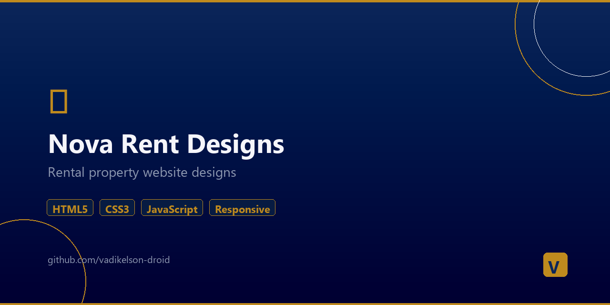

# 🏠 Nova Rent — Car Rental Website Designs



> 14 unique design variants for a car rental business. Multi-language, admin panel, responsive.

## Features
- **14 design variants** — different color schemes and layouts
- **Multi-language** support (lang/ folder)
- **Admin panel** — content management
- **Account page** — user registration and login
- **Responsive** — mobile-first design

## Design Variants
| # | Name | Style |
|---|------|-------|
| 1 | Premium | Luxury dark theme |
| 2 | Modern | Clean contemporary |
| 3 | Warm | Earthy tones |
| 4 | Classic | Traditional business |
| 5 | Neon | Vibrant accent colors |
| 6 | Ocean | Blue marine palette |
| 7 | Dark Pro | Professional dark |
| 8 | Sunset | Warm gradient theme |
| 9 | Arctic | Cool minimal |
| 10 | Emerald | Green luxury |
| 11 | Midnight | Deep dark theme |
| 12 | Coral | Warm pink accents |
| 13 | Slate | Gray professional |
| 14 | Golden | Gold luxury theme |

## Structure
```
nova-rent-designs/
├── index.html              # Main page
├── admin.html              # Admin panel
├── account.html            # User account
├── variant-1-premium.html  # 14 design variants
├── ...
├── variant-14-golden.html
├── css/                    # Stylesheets
├── js/                     # Scripts
└── lang/                   # Translations
```

## Technologies
`HTML5` `CSS3` `JavaScript` `i18n` `Responsive Design`

## Author
**Vadim Dev** — [Portfolio](https://vadikelson-droid.github.io/vadim-portfolio/)
